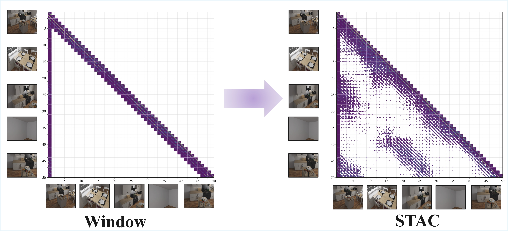

# STAC: Sparse Token Attention Cache for Streaming 3D Reconstruction

**STAC** is a **plug-and-play** KV-cache module for memory-efficient streaming 3D reconstruction over long videos. It compresses evicted KV-cache tokens into a 3D voxel pool and retrieves them on demand — compatible with any causal vision transformer backbone.

- [Overview](#overview)
- [Installation](#installation)
- [Checkpoints and Datasets Preparation](#checkpoints-and-datasets-preparation)
- [Quick Start](#quick-start)
- [Demos](#demos)
- [Evaluation](#evaluation)
- [Key arguments](#key-arguments)
- [Architecture](#architecture)
- [Project structure](#project-structure)
- [Citation](#citation)

---


| Capability         | Full Attention | Causal / Window   | **STAC (Ours)**           |
| ------------------ | -------------- | ----------------- | ------------------------- |
| Attention          | All frames     | Sliding window    | Window + voxel retrieval  |
| Memory scaling     | O(N²)          | O(W) fixed window | O(W) + bounded voxel pool |
| Long-video support | ✗ (OOM)        | ✓ (no history)    | ✓ (with spatial memory)   |


<p align="center">
  
</p>
<p align="center"><em>Attention pattern: Window (local only) vs. STAC (selective long-range retrieval with bounded cache).</em></p>


**Supported backbones** (switch via `--base_model`): [STream3R](https://github.com/NIRVANALAN/STream3R) (`stream3r`) · [StreamVGGT](https://github.com/wzzheng/StreamVGGT) (`streamvggt`)

## Overview

Feed-forward 3D models ([STream3R](https://github.com/NIRVANALAN/STream3R), [StreamVGGT](https://github.com/wzzheng/StreamVGGT)) scale poorly on long videos (O(N²) memory); sliding-window attention avoids OOM but loses history. **STAC** merges evicted tokens into a 3D voxel pool by world coordinates and retrieves the most relevant *pivot* tokens at each step, keeping long-range spatial memory with bounded memory and compute.

<p align="center">
  
</p>
<p align="center"><em>Overview: STAC with Causal-VGGT (left) and runtime–memory scaling vs. baseline (right).</em></p>

### Key features

- **Plug-and-play** — switch backbones via `--base_model`; no code changes.
- **Memory-constrained** — working temporal cache + long-term voxel merge keep KV growth bounded over long streams.
- **Efficient inference** — chunk-based StreamSession and optional CUDA (merger + attn) for stable latency and higher throughput.

## Installation

> **Tested GPUs:** NVIDIA RTX 3090 (24 GB) and A100 (40 GB).

```bash
git clone https://github.com/Rainzor/STAC.git
cd STAC
conda create -n stac python=3.11 cmake=3.14.0 -y
conda activate stac
```

Install [PyTorch](https://pytorch.org/get-started/locally/) for your CUDA (e.g. `cu128` or `cu118`), then dependencies:

```bash
# Example: CUDA 12.8
pip install torch==2.7.0+cu128 torchvision==0.22.0+cu128 torchaudio==2.7.0+cu128 \
--index-url https://download.pytorch.org/whl/cu128 

pip install -r requirements.txt
```

### CUDA KV merger (`merger-cuda`)

`merger-cuda` is an optional CUDA extension for faster voxel merging (`--voxel_backend cuda`).

Build from repo root (with `CUDA_HOME` set):

```bash
pip install -e merger-cuda --no-build-isolation
```

### CUDA attention extension (`attn-cuda`)

`attn-cuda` is an optional CUDA extension used by STAC attention decoding. It provides:

- FlashAttention forward (`out`, `lse`)
- Optional vector bias (`[B,H,N]` / `[B,H,1,N]` / `[1,H,1,N]`)
- Optional column-sum (`colsum`) for retrieval scoring
- Optional colsum subsampling (`subsample_ratio`)

Build from repo root:

```bash
pip install -e attn-cuda --no-build-isolation
```

Runtime switches:

```bash
# Use CUDA attention backend (default)
python eval/long_recon/launch.py --attn_backend cuda ...

# Optional colsum subsampling ratio used by sparse decode path
python eval/long_recon/launch.py --attn_backend cuda --subsample 0.25 ...
```

## Checkpoints and Datasets Preparation

Put checkpoints and datasets in the right place so eval and demos can find them. Symlinks under `data/` are fine.

**Checkpoints** — Place backbone weights under `ckpt/{stream3r|streamvggt}/` as `model.safetensors`, `model.pt`, or `model.pth` (auto-detected).


| Backbone   | Hugging Face                                                      |
| ---------- | ----------------------------------------------------------------- |
| STream3R   | [yslan/STream3R](https://huggingface.co/yslan/STream3R) (default) |
| StreamVGGT | [lch01/StreamVGGT](https://huggingface.co/lch01/StreamVGGT)       |


```bash
# Download at least one backbone (run from repo root)
mkdir -p ckpt/stream3r && hf download yslan/STream3R --local-dir ckpt/stream3r
# StreamVGGT: mkdir -p ckpt/streamvggt && hf download lch01/StreamVGGT --local-dir ckpt/streamvggt
# Use HF_ENDPOINT=https://hf-mirror.com for mirrors.
```

**Datasets** — Put scenes under `data/` with layout `data/<dataset>/<scene>/images/*.png` (e.g. `data/7scenes/chess/images/`). Supported: `7scenes`, `neural_rgbd`, `DTU`, `tum`, `scannet`, `sintel`, `bonn`, `kitti`. Preprocessing follows [CUT3R](https://github.com/CUT3R/CUT3R/blob/main/docs/preprocess.md). Pre-processed eval sets: [Hugging Face](https://huggingface.co/datasets/yslan/pointmap_regression_evalsets).

**Suggested layout:**

```text
STAC/                          # run all commands from repo root
├── ckpt/
│   ├── stream3r/
│   │   └── model.safetensors   # or model.pt / model.pth
│   └── streamvggt/
│       └── model.safetensors
├── data/
│   └── <dataset>/<scene>/images/*.png
├── eval_recon/                 # 3D recon output (created by launch)
├── eval_cam_results/           # pose output
└── eval_depth/                 # depth output
```

**To run:** ensure at least one backbone in `ckpt/` and a scene with an `images/` subfolder (png/jpg); run from `STAC/`.

## Quick Start

### Python API

Run from repo root. Example script:

```python
import torch
from pathlib import Path
from eval.utils.image import load_images_for_eval as load_images
from causalvggt.utils.helper import ImgNorm2Unit as ImgDust3r2Stream3r
from model_wrapper import load_model, run_model

device = "cuda"
scene_dir = Path("data/7scenes/chess")  # should contain images/*.png or *.jpg

# Use the same resize/crop pipeline as eval launch scripts.
size = 518
loaded = load_images(str(scene_dir / "images"), size=size, verbose=False)
images = torch.cat([x["img"] for x in loaded], dim=0)   # DUSt3R range [-1, 1]
images = ImgDust3r2Stream3r(images).to(device)          # convert to [0, 1]

# Pick any supported backbone: "stream3r" or "streamvggt"
model = load_model("causalvggt", base_model="stream3r", device=device)
# Optional: override checkpoint location (file or directory)
# model = load_model("causalvggt", base_model="stream3r", device=device, model_path="/path/to/model.pth")

# mode="stac" auto-enables streaming + recommended STAC params
predictions = run_model(model, images, "causalvggt", mode="stac")
# predictions keys: extrinsic, intrinsic, depth, depth_conf,
#                   world_points, world_points_conf, timing, merger, ...
```

Switching backbones is a one-line change:

```python
# Use StreamVGGT backbone instead
model = load_model("causalvggt", base_model="streamvggt", device=device)
```

### Command line

`main.py` provides a minimal inference example on a scene folder; eval scripts add dataset loading and metrics. Scene dirs need an `images/` subfolder with `.png` or `.jpg` files.

```bash
# Recommended: use the STAC preset.
# --mode stac expands to:
#   mode=window_chunk_merge, streaming=True, win=4, ck=4, hh=2, ret_sz=2, ret_buf=True
python eval/long_recon/launch.py --output_dir eval_recon 
    --dataset_type NRGBD \
    --model_name causalvggt --base_model stream3r \
    --mode stac --save_tag stac

# Equivalent explicit configuration (same as `--mode stac` defaults).
python eval/long_recon/launch.py --output_dir eval_recon 
    --dataset_type NRGBD \
    --model_name causalvggt --base_model stream3r \
    --mode window_chunk_merge --streaming \
    -ck 4 -win 4 -hh 2 -ret_sz 2 -ret_buf

# Evaluate with window size 8
python eval/long_recon/launch.py --output_dir eval_recon 
    --dataset_type NRGBD \
    --model_name causalvggt --base_model stream3r \
    --mode window_kv --streaming -win 8
```

## Demos

- **Gradio:** `python demo/app_stream3r.py`
- **Viser 3D:** `python demo/demo_viser.py --scene_dir /path/to/scene`
- **COLMAP:** `python demo/demo_colmap.py --scene_dir /path/to/scene --output_dir output/colmap`

## Evaluation

Use `--base_model` to switch backbones. Batch run:


| Task              | Batch script                                         | Single-run entry                                                               |
| ----------------- | ---------------------------------------------------- | ------------------------------------------------------------------------------ |
| 3D reconstruction | `[eval/long_recon/run.sh](eval/long_recon/run.sh)`   | `eval/long_recon/launch.py` (e.g. `--dataset_type NRGBD --scene_name complete_kitchen`)                      |
| Camera pose       | `[eval/cam_pose/run.sh](eval/cam_pose/run.sh)`       | `eval/cam_pose/launch.py` (e.g. `--dataset_type tum`)                          |
| Video depth       | `[eval/video_depth/run.sh](eval/video_depth/run.sh)` | `eval/video_depth/launch.py` && `eval/video_depth/eval_depth.py --align scale` |


Common flags: `--model_name causalvggt --base_model stream3r --mode stac`. Eval scripts default to `--voxel_backend cuda` and `--allocator segment`.

## Key arguments

The arguments below are used by the evaluation and inference pipeline. **Not every script exposes all of them:** `eval/long_recon/launch.py` supports the full set; `eval/cam_pose/launch.py` and `eval/video_depth/launch.py` support a subset (model, mode, streaming, window/chunk/hh/retrieval, voxel_backend, size, etc.). For programmatic use, see `model_wrapper.run_model()` and the `stac` / `stream_session` APIs.

**Command line arguments (eval scripts)**

#### --model_name

  Model variant, `causalvggt` by default.

#### --base_model

  Backbone: `stream3r` or `streamvggt`.

#### --mode

  Attention mode; see [Attention modes](#attention-modes). Default: `stac` (recommended preset).

#### --streaming

  Enable frame-by-frame inference via StreamSession (off by default).

#### --window_size / -win

  Sliding KV window size in frames. Default: `0`.

#### --chunk_size / -ck

  Frames per forward pass. Default: `1`.

#### --hh_size / -hh

  Heavy-hitter frames (H2O). Default: `0`.

#### --retrieval_size / -ret_sz

  Voxel pivots per step; `-1` = all. Default: `0`.

#### --retrieve_buf / -ret_buf

  Include retrieved pivots in buffer (API: `return_buf=True`). Off by default.

#### --pinned

  Frame indices pinned in KV cache. Default: `0`.

#### --voxel_size

  Voxel grid resolution in meters. Default: `0.05`.

#### --voxel_num

  Initial voxel pool size. Default: `4096`.

#### --voxel_buf_cap

  Max KV entries per buffer voxel. Default: `8`.

#### --voxel_piv_cap

  Max KV entries per pivot voxel. Default: `4`.

#### --voxel_backend

  `python` or `cuda`; eval scripts default to `cuda`.

#### --allocator / -alloc

  `static`, `slab`, or `segment`; eval scripts default to `segment`.

#### --temperature

  H2O score temperature. Default: `0.9`.

#### --attn_backend

  Sparse decode attention backend: `cuda` or `triton`. Default: `cuda`.

#### --subsample

  Colsum subsampling ratio in `(0, 1]`. Default: `1.0`.

#### --size

  Input resolution. Default: `518`.

**Env:** `VERBOSE=1` — per-frame KV stats; `MERGER_MEM_PROFILE=1` — CUDA memory fragmentation at cleanup.

## Architecture

```
┌────────────────────────────────────────────────────────┐
│  Backbone (interchangeable)                            │
│  ┌─────────────┐ ┌─────────────┐ ┌─────────────────┐   │
│  │  STream3R   │ │ StreamVGGT  │ │    (others)     │   │
│  └──────┬──────┘ └──────┬──────┘ └────────┬────────┘   │
│         └───────────────┼─────────────────┘            │
│                         ▼                              │
│  CausalVGGT Adapter (causalvggt/models/vggt.py)        │
│  ┌─────────────────────────────────────────────────┐   │
│  │ CausalAggregator (24-layer ViT-L)               │   │
│  │   └─ CausalAggregator (KV-cache)                │   │
│  │ CameraHead → extrinsic + intrinsic              │   │
│  │ DPTHead (×2) → depth map + point map            │   │
│  └─────────────────────────────────────────────────┘   │
└─────────────────────────────┬──────────────────────────┘
                              │ KV pairs
                              ▼
┌─────────────────────────────────────────────────────────┐
│  STAC KV-Cache (stac/)  ← plug-and-play                 │
│  ┌───────────────────────────────────────────────────┐  │
│  │ KVManager   sliding window (recent + pinned)      │  │
│  │ ├ H2O       heavy-hitter selection                │  │
│  │ └ STACVoxel 3D voxel pool: evict→merge→retrieve   │  │
│  └───────────────────────────────────────────────────┘  │
└─────────────────────────────┬───────────────────────────┘
                              │
                              ▼
┌─────────────────────────────────────────────────────────┐
│  StreamSession (stream_session.py)                      │
│  Frame-by-frame inference + prediction accumulation     │
└─────────────────────────────────────────────────────────┘
```

### Attention modes


| Mode                   | Streaming | Description                                                           |
| ---------------------- | --------- | --------------------------------------------------------------------- |
| `stac`                 | Yes       | **Recommended** preset (= `window_chunk_merge` + default STAC params) |
| `full`                 | No        | Full attention (memory ∝ N²)                                          |
| `causal` / `window_kv` | Yes       | Sliding window KV cache                                               |
| `window_chunk_merge`   | Yes       | Chunked window + voxel merge (manual param tuning)                    |


## Project structure

`Recommended project layout` above focuses on runnable directory organization.  
This section focuses on core code modules and responsibilities.


| Path                                            | Role                                                                         |
| ----------------------------------------------- | ---------------------------------------------------------------------------- |
| `main.py`                                       | Minimal inference example (scene folder → predictions)                       |
| `model_wrapper.py`                              | Unified `load_model` / `run_model` for all backbones                         |
| `stream_session.py`                             | Frame-by-frame streaming and prediction accumulation                         |
| `causalvggt/`                                   | CausalVGGT adapter: models, SparseAttention, heads                           |
| `stac/`                                         | KV manager, H2O, voxel merge/retrieval, merger, allocator, Triton flash attn |
| `eval/long_recon/`, `cam_pose/`, `video_depth/` | 3D recon, pose, depth                                                        |


## Citation

If you find this work useful, please cite:

```bibtex
@inproceedings{wang2025vggt,
  title     = {VGGT: Visual Geometry Grounded Transformer},
  author    = {Wang, Jianyuan and Chen, Minghao and Karaev, Nikita and Vedaldi, Andrea and Rupprecht, Christian and Novotny, David},
  booktitle = {CVPR},
  year      = {2025}
}
```

```bibtex
@article{stream3r2025,
  title     = {STream3R: Scalable Sequential 3D Reconstruction with Causal Transformer},
  author    = {Lan, Yushi and Luo, Yihang and Hong, Fangzhou and Zhou, Shangchen and Chen, Honghua and Lyu, Zhaoyang and Yang, Shuai and Dai, Bo and Loy, Chen Change and Pan, Xingang},
  booktitle = {arXiv preprint arXiv:2508.10893},
  year      = {2025}
}
```

```bibtex
@article{streamvggt2025,
  title     = {Streaming 4D Visual Geometry Transformer},
  author    = {Zhuo, Dong and Zheng, Wenzhao and Guo, Jiahe and Wu, Yuqi and Zhou, Jie and Lu, Jiwen},
  journal   = {arXiv preprint arXiv:2507.11539},
  year      = {2025}
}
```

## Acknowledgments

STAC builds upon the following excellent open-source projects:

[VGGT](https://github.com/facebookresearch/vggt) | [STream3R](https://github.com/NIRVANALAN/STream3R) | [StreamVGGT](https://github.com/wzzheng/StreamVGGT) | [CUT3R](https://github.com/CUT3R/CUT3R) | [Spann3R](https://github.com/HengyiWang/spann3r)

## License

STAC source code in this repository is licensed under the MIT License.
See the top-level `LICENSE` file.

Third-party components may use different licenses:

- Vendored CUTLASS/CuTe headers under `attn-cuda/third_party/cutlass/` are licensed by NVIDIA under BSD-3-Clause (see `attn-cuda/third_party/cutlass/LICENSE.txt` and `attn-cuda/third_party/cutlass/NOTICE`).
- Upstream model/backbone projects retain their own licenses and terms:
[VGGT](https://github.com/facebookresearch/vggt),
[STream3R](https://github.com/NIRVANALAN/STream3R),
[StreamVGGT](https://github.com/wzzheng/StreamVGGT).

